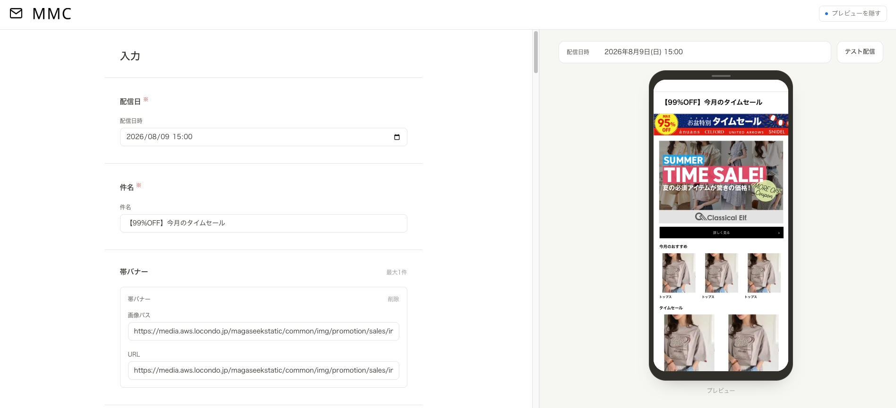
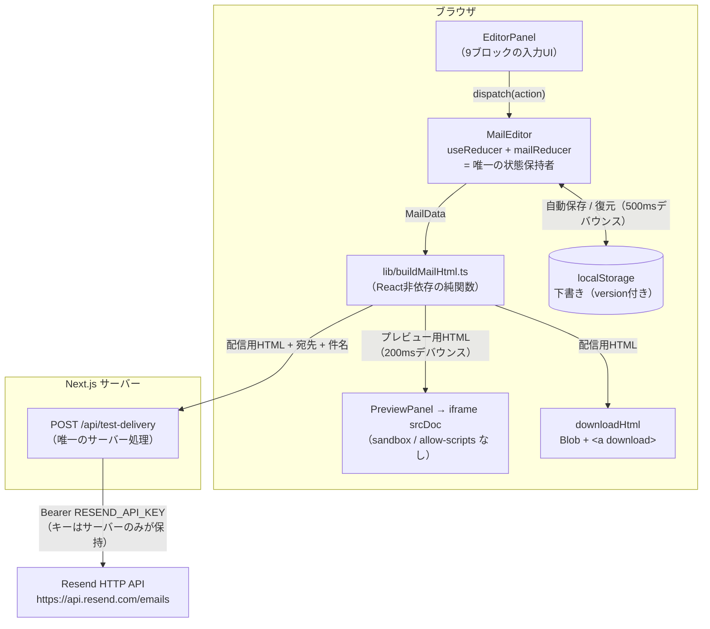

# MMC - Mail-Magazine-Creator （HTMLメルマガ作成ツール）
> HTMLメールを、HTMLを書かずに作成・プレビュー・テスト配信できるWebアプリケーション

### DEMO URL
[Mail Magazine Creator](https://mail-magazine-creator.vercel.app/)


## プロジェクト概要

HTMLメールをGUI上で作成・編集できるWebアプリケーションです。
メルマガのコンテンツを入力すると、実際に配信されるHTMLメールの見た目をスマホ枠で確認でき、そのままHTMLファイルとして書き出し、テスト配信まで行えます。

## 開発背景・目的

### なぜ作ろうと思ったのか
前職で週に50を超える手動メルマガ作成を行なってきました。当時そのメルマガテンプレートをExcel（VBA）にて作成していましたが、web上でリアルタイムプレビュー、検証、テスト配信まで一括でできるツールがあれば良いなと思い、作成しました。

### 想定ユーザー

メルマガを定期配信する企業のマーケティング・広報担当者、およびその制作を担当する制作者

### 課題と解決策

| 課題                                                                              | このツールでの解決                                                                                     |
| --------------------------------------------------------------------------------- | ------------------------------------------------------------------------------------------------------ |
| HTMLメールは table + インラインCSS でしか安定しない。手書きは非効率で、崩れやすい | レイアウトを**9ブロックの固定テンプレートに限定**し、入力からHTMLを機械生成する                        |
| 毎回の作業は「文言・画像・リンクの差し替え」なのに、毎回HTMLを触ることになる      | 入力欄をブロック単位に分け、**HTMLを一切書かずに1通を組める**ようにする                                |
| 完成形が配信直前まで分からない。ブラウザで開いた見た目は実機と違う                | 600px幅のメールをスマホ枠で常時プレビューし、さらに**実際のメールとして1通送って確認**できるようにする |
| リンク切れ・不正URLに気づかないまま配信してしまう                                 | URL形式を即時検証し、エラーが残っているあいだは**HTML出力もテスト配信も止める**                        |


## 使用技術

| 分類          | 使用技術                                                                                               |
| ------------- | ------------------------------------------------------------------------------------------------------ |
| Frontend      | Next.js 16.2（App Router）/ React 19.2 / TypeScript 5 / Tailwind CSS v4                                |
| Backend / API | Next.js Route Handler（`app/api/test-delivery/route.ts`）1本のみ                                       |
| Database      | **なし**。入力内容の永続化はブラウザの localStorage                                                    |
| External API  | [Resend](https://resend.com/) の HTTP API（SDKは使わず `fetch` で直接呼ぶ）                            |
| Testing       | Jest 30 ＋ React Testing Library ＋ jest-dom / user-event、Storybook 10（`addon-a11y` / `addon-docs`） |
| Lint / Format | ESLint 9（flat config、`eslint-config-next`）/ Prettier 3（`prettier-plugin-tailwindcss`）             |
| CI            | GitHub Actions（lint → format:check → typecheck → test → build → build-storybook）                     |
| Runtime       | Node.js 22 以上（`.nvmrc` / `engines` で固定）                                                         |


## スクリーンショット


## 主な機能

### 入力ブロック（9種）

| #   | ブロック                       | 入力項目                                                                                | 必須 | メール本文への出力                                       |
| --- | ------------------------------ | --------------------------------------------------------------------------------------- | ---- | -------------------------------------------------------- |
| 01  | 配信日                         | 日時（内部表現は `YYYYMMDDhhmm`）                                                       | ○    | 出さない（プレビュー上部のメタ欄・出力ファイル名に使用） |
| 02  | 件名                           | テキスト                                                                                | ○    | 出さない（端末画面上部の件名バー・`<title>` に使用）     |
| 03  | 帯バナー（最大1件）            | 画像URL / リンクURL                                                                     | −    | 最上部に600px全幅の画像。URLがあれば画像全体がリンク     |
| 04  | 大バナー（最大3件）            | 画像URL / リンクURL / ボタンURL / ボタンテキスト / 文字色 / 背景色                      | −    | 1カラムで縦積み。画像＋任意のボタン                      |
| 05  | 3カラムボックス（最大1セット） | タイトル / タイトル文字色、アイテム最大18件、ボタン最大3件                              | −    | 3カラム左寄せ（セル幅176px）                             |
| 06  | 2カラムボックス（最大1セット） | 同上（アイテムにノーマルテキストが加わる）                                              | −    | 2カラム左寄せ（セル幅268px）                             |
| 07  | 下部大バナー（最大5件）        | タイトル / タイトル文字色 ＋ 04と同じバナー入力                                         | −    | 1カラムで縦積み                                          |
| 08  | トピックスエリア（最大8件）    | タイトル / タイトル文字色、アイテム（画像 / URL / 太字 / ノーマル / 文字色）、ボタン1件 | −    | 画像160px ＋ テキスト376px の横並びを縦積み              |
| 09  | インフォメーション（最大3件）  | URL / リンクテキスト                                                                    | −    | フッターに中央寄せで縦積み                               |

### 機能一覧

- **リアルタイムプレビュー** — iframe に `srcDoc` で描画。入力から約200msで反映（打鍵そのものは即時反映）
- **スマホ枠プレビュー固定** — iPhone 16 の画面比（393:852）を保った枠に載せ、`lg` 以上ではビューポートに固定。入力をどれだけスクロールしても隠れない
- **プレビュー開閉** — 閉じると入力エリアが横幅いっぱいを使う
- **HTML出力** — 配信用HTMLを `YYYYMMDD_hhmm.html` としてダウンロード（サーバー送信なし）
- **テスト配信** — 作成中の内容をそのまま1通だけ実アドレスへ送信（Resend 経由）
- **入力の自動保存 / 復元 / 全消去** — localStorage に500msデバウンスで保存。復元時は帯で通知、全消去は2段階確認
- **バリデーション** — 必須項目・URL形式・メールアドレス形式。エラーが残っていればHTML出力とテスト配信を同じ理由で停止
- **レスポンシブ** — `lg` 未満は縦積みレイアウト（プレビューは `70vh`）
- **Storybook** — 共通UI部品のカタログと a11y チェック（14ストーリーファイル）


## 🏗️ システム構成

データの流れは**一方向**です。`MailData`（唯一の状態）→ `buildMailHtml`（純関数）→ プレビュー / ダウンロード / テスト配信、と一本道になっており、HTMLの生成箇所は1か所しかありません。



ポイントは3つです。

1. **サーバー処理は1本だけ** — `/api/test-delivery` は APIキーをブラウザに露出させないためだけに存在します。それ以外（HTML生成・プレビュー・ダウンロード・下書き保存）はすべてブラウザ内で完結します。
2. **DBを持たない** — 1通ぶんの下書き以外に保存すべき状態がないため、localStorage で足ります。認証もサーバー側の永続化も不要になり、構成が単純になります。
3. **HTMLを生成するのはクライアントだけ** — テスト配信でも `MailData` ではなく**生成済みのHTML文字列**をPOSTします。サーバーでも生成すると「プレビューと同じ物が届く」保証が崩れるためです。

## 💡 技術的な工夫・設計

### 1. 状態は1か所・更新ロジックは純関数

状態を持つコンポーネントは `components/MailEditor.tsx` **ただ1つ**です。入力はネスト（帯バナーは `null` 可）と可変長配列（カラムセット > アイテム / ボタンの3段）を含むため、更新ロジックを `lib/mailReducer.ts` に純関数として切り出し、`useReducer` で束ねています。値を読むのは `EditorPanel` と `PreviewPanel` の2つだけなので、Context も状態管理ライブラリも導入していません。

- **副作用はリデューサに入れない** — `crypto.randomUUID()` による id 採番は `MailEditor` 側で行い、action に載せて渡します。リデューサを純関数に保つことで、リストの追加・削除・上限・不変性をすべてユニットテストで検証できます
- **入れ子リストの更新は3ヘルパに集約** — `addToList` / `removeFromList` / `updateInList`。件数の上限チェックは `addToList` の内側にあるため、UIの `disabled` とあわせて二重に守られます

### 2. 3カラム / 2カラムを「同一実装 + 設定1か所」に畳む

05（3カラム）と06（2カラム）は、列数・文字数上限・セル幅・ノーマルテキストの有無しか違いません。そこで型・リデューサ・UI・HTML生成をすべて共通化し、**差分は `types/mail.ts` の `COLUMN_VARIANT_CONFIG` 1か所**に集めました。

```ts
export const COLUMN_VARIANT_CONFIG = {
  three: { stateKey: 'threeColumnSets', columns: 3, boldMaxLength: 10, normalMaxLength: null, cellWidth: 176, gapWidth: 12, ... },
  two:   { stateKey: 'twoColumnSets',   columns: 2, boldMaxLength: 15, normalMaxLength: 26,   cellWidth: 268, gapWidth: 16, ... },
} as const satisfies Record<ColumnVariant, ColumnVariantConfig>;
```

カラム系のアクションはすべて `variant` を持ち、`COLUMN_VARIANT_CONFIG[variant].stateKey` で対象の配列を決めます。3カラム用・2カラム用にアクションを二重定義しない設計です。テストも `describe.each(['three', 'two'])` で必ず両方を回し、片方だけ通る状態を作らないようにしています。

同じ考えで、`LargeBanner`（04と07で共用）、`ButtonContent`（05 / 06 / 08で共用）、`TitleFields` / `buildBlockTitle`（05〜08で共用）と、ブロックを増やすたびに新しい型を足すのではなく既存を一般化して寄せました。

### 3. HTML生成をReactから切り離す

`buildMailHtml(data: MailData, options?: { forPreview?: boolean }): string` は React に依存しない純関数です。プレビュー・ダウンロード・テスト配信の3経路がすべてこの1関数を通るため、「画面で見た物と届く物が違う」事故が構造的に起きません。

メールクライアント（Gmail / Outlook 等）は `<head>` のCSSを落とすことがあるため、**レイアウトはすべて table、装飾はインライン style** で組んでいます。その制約下での工夫の例:

- **ボタンの矢印は画像ではなく文字（`&rsaquo;`）** — 配信されたメールから参照できる画像置き場がこのツールには無く、`data:` URI の画像は Gmail 等がブロックするためです。文字なら色がボタンの文字色に追従し、Hiragino / Meiryo / Arial のいずれにも収録されているため豆腐になりません
- **ボタンは「余白 / テキスト / 矢印」の3セル構成** — メールでは `position` も `float` も使えません。左右のセルを同じ幅（40px）にすることでテキストがボタンの正確な中央に来ます。3セルすべてを `<a>` で埋め、どこを押しても遷移します。生成は `buildButtonRow` 1本に集約し、4種類のボタンすべてが同じ見た目になります
- **中身が0件のブロックはタイトルごと出さない** — 07 / 08 は入力側でもタイトル欄を隠し、`buildMailHtml` 側も同じ条件で `''` を返します。**画面に出ていない値が配信物に混ざらない**ことを優先しました（入力値自体は state に残るので、追加し直せば戻ります）

### 4. プレビューは「600pxで描画してから縮小する」

メール本体は `width:600px` 固定で、3カラムのセル幅（176px×3）も固定です。iframe を実機幅（390px）にすると、はみ出して横スクロールになってしまいます。

そこで **描画は原寸600pxのまま、`transform: scale()` で見た目だけ縮める**方式を採りました。`zoom` を使わないのは、iframe内部のレイアウト幅まで変わり「600pxのメールとしての見た目」を保証できなくなるためです。幅の定数は `types/mail.ts` の `MAIL_WIDTH` に集約し、HTML生成とプレビューが同じ値を参照します。

- **プレビュー用HTMLだけ body余白とスクロールバーを外す** — カードは `width:600px; max-width:100%` なので、iframeの実効幅が600pxを1pxでも下回るとカードが縮み、3カラムの固定幅セルがはみ出します。`forPreview: true` はこの2つを外すためのオプションで、本文の中身は配信用と完全に同一です
- **縮小率はJSで測る** — 「高さ → 幅 → 縮小率」と決まる無次元の比はCSSでは作れません（`calc(100cqw / 600px)` は書けない）。`hooks/useElementSize.ts` の `ResizeObserver` で実寸だけを測り、`PhoneMock` が `--phone-scale` を算出します
- **計測が済むまで端末枠は `opacity-0`** — SSRのHTMLには上限値の枠（413×892px）が焼き込まれるため、そのまま見せるとリロードのたびに「大きい枠 → 縮む」が見えます。あわせて `getBoundingClientRect()` による同期初期計測を入れています（`ResizeObserver` の初回コールバックは paint 後に来るため、これが無いと hydration 後にもう1フレーム未計測の大きさで描かれる）
- **件名バーは iframe の外** — 件名はメール本文ではなくヘッダ情報です。`buildMailHtml` に入れるとダウンロードしたHTMLに混ざるため、実際のメーラーと同じく端末画面上部の固定帯として親側で描いています。ここだけ等倍なので、プレビューを縮めても件名は読めます

### 5. レイアウトはアプリシェル固定（`lg` 以上）

入力ブロックが9つあるため、ページ全体をスクロールさせるとプレビューがすぐ画面外へ流れます。`lg` 以上では **body をビューポート高に固定**し、スクロールはエディタ列だけが内部で担当します。

`sticky + calc(100vh - ヘッダ高)` にしなかったのは、**ヘッダ高をCSS定数として二重管理したくない**ためです。この方式ならヘッダの padding を変えてもプレビュー高が自動追従します。なお flex/grid の子は既定で `min-height:auto` のため、`body → main → 各列 → 端末枠` まで `min-h-0` を連鎖させています（1か所でも落とすと固定が壊れます）。

### 6. バリデーションとエラーハンドリング

`validateMailData` は**エラーが無いキーを省いた入れ子オブジェクト**を返します。トップレベルのキー数を見るだけで「エラーの有無」を判定でき（`hasValidationErrors`）、UI側は id をキーに引くだけで該当の入力欄にエラーを出せます。

ユーザー体験の観点で入れた分岐が2つあります。

- **必須（配信日・件名）の未入力エラーだけは、出力を試みるまで画面に出さない**（`omitRequiredErrors` ＋ `hasTriedExport`）。何も入力していない初期表示でいきなり赤字が2つ並ぶのは、指摘というより入力の邪魔だからです。URLエラーは「入力した結果」なので常に即時に出します
- **出力ボタンは `disabled` にしない**。押せないボタンは「なぜ押せないのか」を返せません。押した時点で理由を1つだけ出して出力を止めます。理由の判定は `describeBlockedReason` に集約し、HTML出力とテスト配信で文言と優先順（必須の欠け → URLエラー）を揃えています。例外はテスト配信モーダルの送信中だけで、ここは二重送信の防止として `disabled` にします

メールアドレスの検証は RFC 5322 を厳密になぞらず、**打ち間違いを拾う程度**（空白なし・`@` が1つ・ドメインにドット）に留めています。最終的な可否は送信先のメールサーバーしか知らないため、厳密な正規表現は「送れるアドレスを弾く」事故を増やすだけと判断しました。

### 7. セキュリティ（XSS対策・機密情報の扱い）

プレビューはユーザーの入力をそのままHTMLとして描画するため、入口を3つに絞って守っています。

| 対象         | 手段                                                | 理由                                                                                                                               |
| ------------ | --------------------------------------------------- | ---------------------------------------------------------------------------------------------------------------------------------- |
| テキスト全般 | `escapeHtml`                                        | タグとして解釈させない                                                                                                             |
| URL          | `toSafeHttpUrl`（`http:` / `https:` のみ許可）      | `javascript:` / `data:` を描画経路にしない                                                                                         |
| 色           | `toSafeHexColor`（`#rgb` / `#rrggbb` 以外は既定色） | `style` 属性に直接差し込むため、`red;background:url(...)` のような値が**別の宣言として解釈される**のを防ぐ。エスケープでは守れない |

加えて、プレビューの iframe の `sandbox` から **`allow-scripts` を外して**あります。仮に生成HTMLに何か混入しても、スクリプトとして実行される余地がありません。

機密情報の管理:

- `RESEND_API_KEY` は**サーバー（Route Handler）だけが読む**環境変数です。`NEXT_PUBLIC_` を付けていないためクライアントバンドルには入りません
- **環境変数はリクエストのたびに読みます**。モジュール読み込み時に評価すると、キーを持たない CI で本番ビルドが落ちるためです
- Route Handler は Resend の生のエラーをそのまま返しません。送信元ドメインや内部IDが混ざるため、**詳細はサーバーの console にだけ残し**、画面には固定の日本語メッセージを返します
- テスト配信のエンドポイントは誰でも直接叩けるため、`parseTestDeliveryRequest`（純関数）で型・メール形式・件名の有無・**HTMLのバイト数上限（1MB）**を再検証します。画面側の検証を通ったことは前提にしていません
- テスト配信の宛先は `MailData` に入れず、下書きにも保存しません。入力内容ではなく画面の状態であり、共用端末に他人のアドレスが残るほうが困るためです

### 8. 下書きの自動保存で踏んだ落とし穴

1通ぶんの入力量が多いため、`MailData` を localStorage に自動保存（500msデバウンス）しています。単純に見えて、実装上は3つの罠がありました。

```ts
// components/MailEditor.tsx
useEffect(() => {
  // これが無いと「復元より先に保存が走り、保存済みの下書きを空で上書きする」
  if (draftToSave === INITIAL_MAIL_DATA) return;
  saveDraft(draftToSave);
}, [draftToSave]);
```

- **復元はマウント後の `useEffect` で行う** — `useReducer` の初期値から読むと、localStorage を持たない SSR と描画結果がずれます（hydration 不一致）
- **未編集の判定は参照比較で行う** — リデューサは必ず新しいオブジェクトを返すので、参照が `INITIAL_MAIL_DATA` のままなら未編集と断定できます。フラグや ref で effect の実行順を制御するより堅い作りです（`clearAll` が `INITIAL_MAIL_DATA` をそのまま返すのもこの判定に合わせるためで、削除は `clearDraft()` を明示的に呼びます）
- **保存形式に版を持たせる** — `{ version, data }` で保存し、版が違えば読まずに捨てます。版が同じでもキーが欠けていれば `INITIAL_MAIL_DATA` の上に載せて埋めます

localStorage への読み書きはすべて `try/catch` で包んでおり、保存できない環境（容量超過・無効化）でも入力・プレビュー・HTML出力はそのまま動きます。

### 9. パフォーマンスと再利用性

- **デバウンスは iframe だけ** — `srcDoc` の差し替えは iframe の再読み込みを伴うため200ms遅らせますが、入力欄・メタ欄・件名バーは controlled のまま即時反映されるので打鍵の遅延はありません。下書き保存（同期処理）は別途500ms
- **共通部品に寄せる** — `EditorSection` / `FormField` / `AddItemButton` / `TitleFields` / `ButtonFields` / `fields/*`（Text / Url / DateTime / Color）。新しい入力欄を足すときは、まずここを確認してから作る運用にしています
- **色はトークン経由でのみ参照** — UI側は生のhexを書かず、`app/globals.css` の `@theme` に置いた意味づけ済みトークン（`canvas` / `fg` / `rule` / `accent` / `danger` ほか）だけを使います。おかげでテーマを刷新した際も値の差し替えが中心で済みました。なお **`buildMailHtml` が出す色は配信物の色**なので、このトークンとは無関係です
- **アクセシビリティ** — `FormField` がラベル・エラーの `aria-describedby` / `aria-invalid` を結線し、エラーは `role="alert"` で読み上げます。テスト配信モーダルはネイティブの `<dialog>` + `showModal()`（Esc で閉じる・背景の操作を止める・フォーカストラップをブラウザに任せる）。プレビュー開閉ボタンは `aria-expanded` / `aria-controls` を持ちます

### 10. ユーザー体験の細部

- **入力欄は「追加」してから出す** — 任意ブロックは初期表示では追加ボタンだけを置きます。9ブロックぶんの空欄が最初から縦に積まれていると、どこから書けばよいか分からなくなるためです
- **`DateTimeField` だけ表示値をローカル state で持つ** — `input[type=datetime-local]` は打鍵途中の値が巻き戻ると入力できなくなるためです。ただし初期値だけ見る作りにすると、マウント後に走る下書き復元が反映されません。`value !== syncedValue` のときだけ props に追従させています
- **全消去は2段階確認** — インラインで確認を挟み、ブラウザの `confirm` は使いません

## 🧪 テスト

**Jest 30 + React Testing Library**。19ファイル・295テストが通ります（`npm test` / 2026年8月時点）。

```bash
npm test              # 全テスト
npm run test:watch    # watch モード
npm run test:coverage # カバレッジ付き
```

テストとストーリーは**対象ファイルの隣**に置いています（コロケーション）。`tsconfig.json` の `include` が `**/*.ts(x)` なので、`next build` はテスト・ストーリーも型チェックします。

| 対象                                                                | 観点                                                                                                                                                    |
| ------------------------------------------------------------------- | ------------------------------------------------------------------------------------------------------------------------------------------------------- |
| `lib/buildMailHtml.test.ts`                                         | エスケープ、URL / 色のサニタイズ、「中身0件のブロックを出さない」、プレビュー用と配信用の差分。カラムは `describe.each` で3カラム / 2カラムの両方を実行 |
| `lib/mailReducer.test.ts`                                           | 追加・削除・更新、件数上限、**元の state を書き換えていないこと**（不変性）                                                                             |
| `lib/validation.test.ts`                                            | 必須チェック、URL形式、入れ子エラーの形（エラーの無いキーが省かれること）、出力停止理由の優先順                                                         |
| `lib/testDelivery.test.ts`                                          | リクエストの型検証、メール形式、HTMLバイト数上限                                                                                                        |
| `lib/draftStorage.test.ts`                                          | 保存 / 復元 / 削除、版違いの破棄、キー欠けの補完、例外時のフォールバック                                                                                |
| `lib/deliveryDate.test.ts` / `color.test.ts` / `escapeHtml.test.ts` | 日時の相互変換とファイル名生成、色のサニタイズ、エスケープ                                                                                              |
| `components/**/*.test.tsx`                                          | 共通UI部品の振る舞いとa11y結線（ラベル / エラー / `aria-*`）、テスト配信モーダルの検証・送信・二重送信防止                                              |

方針として決めていること:

- **`buildMailHtml` にスナップショットを使わない** — デザイン調整のたびに `-u` が必要になり、テストが「変更の追認」になってしまうため。仕様を直接アサートします
- **ランナーはJestの1つに保つ** — Storybook公式のテスト統合（`addon-vitest`、Vitest専用）は入れていません。役割を「Jest + RTL = 振る舞いの検証」「Storybook = 見た目のカタログと a11y パネル」で分けています（判断の記録は [`docs/plan-testing.md`](docs/plan-testing.md)）
- **CIで `build-storybook` も回す** — ストーリーの破損を自動で見つける唯一の手段のため

### CI

`.github/workflows/ci.yml` が main への push と全プルリクエストで
`lint` → `format:check` → `typecheck` → `test` → `build` → `build-storybook` を順に実行します。Nodeのバージョンは `.nvmrc` を唯一の出どころにしています。

`typecheck` が `tsc --noEmit` 単体ではなく `next typegen && tsc --noEmit` なのは、`next-env.d.ts` と `.next/types` が生成物でリポジトリに含まれないためです（無い状態で tsc を回すと画像importが型エラーになる）。

## 📁 ディレクトリ構成

```
app/
├── layout.tsx                    metadata とビューポート固定の body
├── page.tsx                      Server Component。シェルのみ
├── globals.css                   テーマトークン（色・フォント）
└── api/test-delivery/route.ts    テスト配信（唯一のサーバー処理）
components/
├── MailEditor.tsx                'use client'。アプリ唯一の状態保持者
├── AppHeader.tsx                 ワードマーク + プレビュー開閉トグル
├── editor/                       入力UI
│   ├── EditorPanel.tsx           9ブロックの組み立て
│   ├── EditorSection.tsx         ブロックの枠（見出し・必須マーク）
│   ├── FormField.tsx             ラベル / エラーの a11y 結線
│   ├── fields/                   入力欄の共通部品（Text / Url / DateTime / Color）
│   ├── TitleFields.tsx           タイトル + 文字色（05〜08 で共用）
│   ├── ButtonFields.tsx          ボタンの4入力（05 / 06 / 08 で共用）
│   ├── ColumnSet*.tsx            カラムボックス（variant で 05 / 06 を兼ねる）
│   ├── *Section.tsx              各ブロック
│   ├── ExportSection.tsx         HTML出力ボタン
│   ├── RestoreNotice.tsx         下書き復元の通知帯
│   └── ClearDraftButton.tsx      全消去（2段階確認）
└── preview/                      プレビューUI
    ├── PreviewPanel.tsx          ビューポート固定の3段構成
    ├── PreviewMeta.tsx           配信日時（iframe の外）
    ├── SubjectBar.tsx            件名バー（等倍で端末上部に固定）
    ├── PhoneMock.tsx             スマホ枠（画面比を保って高さに収める）
    ├── MailFrame.tsx             iframe srcDoc レンダラ（600px描画 → scale縮小）
    ├── TestDelivery.tsx          テスト配信の起動ボタン（宛先もここが持つ）
    └── TestDeliveryDialog.tsx    宛先入力モーダル（<dialog> + showModal）
lib/                              ロジックはすべてReact非依存
├── buildMailHtml.ts              MailData → HTMLメール文字列（純関数）
├── mailReducer.ts                入力状態の更新（純関数）
├── validation.ts                 必須 / URL / メール検証・出力を止める理由
├── testDelivery.ts               テスト配信リクエストの検証（純関数）
├── sendTestMail.ts               /api/test-delivery への POST
├── draftStorage.ts               localStorage への保存 / 復元 / 削除
├── deliveryDate.ts               YYYYMMDDhhmm ⇄ datetime-local ⇄ 表示 / ファイル名
├── downloadHtml.ts               Blob + <a download>
├── color.ts / escapeHtml.ts      サニタイズ
hooks/
├── useDebouncedValue.ts          プレビュー更新・下書き保存の間引き
└── useElementSize.ts             端末枠に使える領域の実寸を購読
types/mail.ts                     MailData・上限値・幅の定数・COLUMN_VARIANT_CONFIG
docs/plan-*.md                    機能ごとの実装計画と設計判断の記録
.storybook/                       Storybook 設定
jest.config.mjs / jest.setup.ts   next/jest ベースの設定 + jsdom に無いAPIのスタブ
```

## 🚀 セットアップ

前提: **Node.js 22 以上**（`.nvmrc` あり。Node 18 では Next.js 16 が起動しません）

```bash
# 1. クローン
git clone git@github.com:Naoki-Takashima/mail-magazine-creator.git
cd mail-magazine-creator

# 2. Node のバージョンを合わせる
nvm use

# 3. 依存をインストール
npm install

# 4. 環境変数を設定（テスト配信を使う場合のみ。次章参照）
#    プロジェクト直下に .env.local を作成する

# 5. 開発サーバーを起動
npm run dev   # http://localhost:3000
```

環境変数を設定しなくても、**入力・プレビュー・HTML出力・下書き保存は動きます**（テスト配信だけがエラーになります）。

その他のスクリプト:

| コマンド                                    | 内容                                            |
| ------------------------------------------- | ----------------------------------------------- |
| `npm run build` / `npm start`               | 本番ビルド / 本番サーバー起動                   |
| `npm run lint`                              | ESLint（flat config、引数なしでリポジトリ全体） |
| `npm run typecheck`                         | `next typegen && tsc --noEmit`                  |
| `npm run format` / `format:check`           | Prettier の整形 / 差分チェック                  |
| `npm test` / `test:watch` / `test:coverage` | Jest                                            |
| `npm run storybook` / `build-storybook`     | Storybook（http://localhost:6006）/ 静的ビルド  |

## 🔐 環境変数

テスト配信機能を使う場合のみ必要です。プロジェクト直下に `.env.local` を作成し、次の2つを設定します（`.env*` は `.gitignore` 済みで、値をリポジトリに入れることはありません）。

```bash
# .env.local
RESEND_API_KEY=re_xxxxxxxxxxxxxxxxxxxx
MAIL_FROM=noreply@example.com
```

| 変数             | 内容                                                                                                          |
| ---------------- | ------------------------------------------------------------------------------------------------------------- |
| `RESEND_API_KEY` | Resend の APIキー（https://resend.com/api-keys で発行）。**サーバーだけが読む**ため `NEXT_PUBLIC_` は付けない |
| `MAIL_FROM`      | 送信元アドレス。**Resend で検証済みのドメイン**でないと送信が拒否される                                       |

どちらかが未設定の場合、テスト配信は送信せず「送信の設定が完了していません」を返します。ホスティング先（Vercel 等）にも同じ2つを設定してください。

## 🔮 今後の改善

**「1通を作る道具」から「継続配信の運用を支える道具」へ**広げることを想定しています。

| 段階     | 内容                                                                                                                                                                                                            |
| -------- | --------------------------------------------------------------------------------------------------------------------------------------------------------------------------------------------------------------- |
| 制作効率 | HTMLソースのクリップボードコピー、大バナー等の**並べ替え**（`mailReducer` に `move*` を追加）、テンプレート保存・切替（現在の下書き保存を複数スロットに拡張）                                                   |
| 確認精度 | PC / スマホの**プレビュー幅切替**（`--phone-scale` の差し替えで実現可能）、ダークモード配信時の見え方確認、プレーンテキスト版の同時生成                                                                         |
| 運用     | 本配信機能と配信予約、配信履歴の保持（ここで初めてDBと認証が必要になる）、開封率・クリック率などの効果測定                                                                                                      |
| 品質     | `MailEditor` の統合テスト（入力 → プレビュー反映まで通す）、E2E（Playwright）、ビジュアルリグレッションテスト、カバレッジ閾値の設定、アクセシビリティのさらなる改善（キーボード操作とフォーカス順序の全面点検） |

なお **「ブロックを自由に配置できる汎用エディタ化」は意図的に候補から外しています**。レイアウトを固定しているからこそ、メールクライアント互換の検証範囲を絞り込めているためです。

## 👤 開発者

- **Naoki Takashima**
- GitHub: [@Naoki-Takashima](https://github.com/Naoki-Takashima)
- リポジトリ: https://github.com/Naoki-Takashima/mail-magazine-creator

個人開発（企画・設計・実装・テスト・CI構築のすべて）。設計判断の過程は [`docs/`](docs/) の実装計画ドキュメントに残しています。
